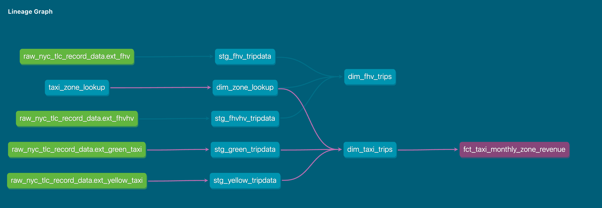

## Module 4 Homework

For this homework, you will need the following datasets:
* [Green Taxi dataset (2019 and 2020)](https://github.com/DataTalksClub/nyc-tlc-data/releases/tag/green)
* [Yellow Taxi dataset (2019 and 2020)](https://github.com/DataTalksClub/nyc-tlc-data/releases/tag/yellow)
* [For Hire Vehicle dataset (2019)](https://github.com/DataTalksClub/nyc-tlc-data/releases/tag/fhv)

### Before you start

1. Make sure you, **at least**, have them in GCS with a External Table **OR** a Native Table - use whichever method you prefer to accomplish that (Workflow Orchestration with [pandas-gbq](https://cloud.google.com/bigquery/docs/samples/bigquery-pandas-gbq-to-gbq-simple), [dlt for gcs](https://dlthub.com/docs/dlt-ecosystem/destinations/filesystem), [dlt for BigQuery](https://dlthub.com/docs/dlt-ecosystem/destinations/bigquery), [gsutil](https://cloud.google.com/storage/docs/gsutil), etc)
2. You should have exactly `7,778,101` records in your Green Taxi table
3. You should have exactly `109,047,518` records in your Yellow Taxi table
4. You should have exactly `43,244,696` records in your FHV table
5. Build the staging models for green/yellow as shown in [here](../../../04-analytics-engineering/taxi_rides_ny/models/staging/)
6. Build the dimension/fact for taxi_trips joining with `dim_zones`  as shown in [here](../../../04-analytics-engineering/taxi_rides_ny/models/core/fact_trips.sql)

**Note**: If you don't have access to GCP, you can spin up a local Postgres instance and ingest the datasets above


### Question 1: Understanding dbt model resolution

Provided you've got the following sources.yaml
```yaml
version: 2

sources:
  - name: raw_nyc_tripdata
    database: "{{ env_var('DBT_BIGQUERY_PROJECT', 'dtc_zoomcamp_2025') }}"
    schema:   "{{ env_var('DBT_BIGQUERY_SOURCE_DATASET', 'raw_nyc_tripdata') }}"
    tables:
      - name: ext_green_taxi
      - name: ext_yellow_taxi
```

with the following env variables setup where `dbt` runs:
```shell
export DBT_BIGQUERY_PROJECT=myproject
export DBT_BIGQUERY_DATASET=my_nyc_tripdata
```

What does this .sql model compile to?
```sql
select * 
from {{ source('raw_nyc_tripdata', 'ext_green_taxi' ) }}
```

- `select * from dtc_zoomcamp_2025.raw_nyc_tripdata.ext_green_taxi`
- `select * from dtc_zoomcamp_2025.my_nyc_tripdata.ext_green_taxi`
- `select * from myproject.raw_nyc_tripdata.ext_green_taxi`
- `select * from myproject.my_nyc_tripdata.ext_green_taxi`
- `select * from dtc_zoomcamp_2025.raw_nyc_tripdata.green_taxi`

### Answer 1: Understanding dbt model resolution

#### Google Generative AI is kind enough to tell me...

    In dbt, "default" refers to the pre-defined values set within your project configuration, while "environment variables" are dynamic values that can be adjusted based on the environment where you run your dbt code, allowing you to customize behavior across different stages like development, staging, and production, essentially letting you override the default settings when needed; you access environment variables within your dbt code using the env_var Jinja function. [1, 2, 3, 4]  
    Key points about dbt environment variables vs default: [1, 2, 3, 4]  
    
    • Purpose: Defaults are used for standard configurations that are likely to be the same across most environments, while environment variables are used to adjust settings based on specific runtime environments. [1, 2, 3, 4]  
    • Accessing values: To access a default value, you would usually reference it directly in your dbt code, whereas to access an environment variable, you use the {{ env_var('VARIABLE_NAME') }} syntax within your Jinja templates. [1, 3, 4, 5]  
    • Flexibility: Environment variables offer more flexibility as they can be modified on the fly depending on where you run your dbt project, allowing for different configurations for development, testing, and production. [1, 2, 3, 4]  
    
    Example: [6, 7]  
    
    • Default: In your dbt_project.yml file, you might set a default target schema as "dev_data" which would be used unless explicitly overridden. [6, 7]  
    • Environment variable: You could set an environment variable called "DBT_TARGET_SCHEMA" to "prod_data" when running dbt in a production environment, effectively changing the target schema based on the environment. [1, 3, 4, 6]  
    
    
    Generative AI is experimental.
    
    [1] https://www.getdbt.com/blog/introducing-environment-variables-in-dbt-cloud[2] https://www.restack.io/docs/dbt-core-knowledge-dbt-core-environment-variables[3] https://www.getdbt.com/blog/what-exactly-is-dbt[4] https://docs.getdbt.com/docs/build/environment-variables[5] https://docs.getdbt.com/reference/dbt-jinja-functions/env_var[6] https://docs.getdbt.com/docs/core/connect-data-platform/connection-profiles[7] https://docs.getdbt.com/reference/global-configs/about-global-configs

Though I generally (strongly) prefer CLI, for once I went with the "cloud IDE" solution and here I am looking at the first question wishing I had stuck with CLI. It looks like having environment variables set override default settings in the CLI, but I assume Cloud is a different animal here.

Ah...

[dbt Cloud Environment Variable Usage](https://docs.getdbt.com/reference/dbt-jinja-functions/env_var#dbt-cloud-usage)

    dbt Cloud usage
    
    If you are using dbt Cloud, you must adhere to the naming conventions for environment variables. Environment variables in dbt Cloud must be prefixed with DBT_ (including DBT_ENV_CUSTOM_ENV_ or DBT_ENV_SECRET). Environment variables keys are uppercased and case sensitive. When referencing {{env_var('DBT_KEY')}} in your project's code, the key must match exactly the variable defined in dbt Cloud's UI.

So...

The *DBT_* prefix will allow us to view use these in Cloud?

If I understand this correctly, the answer should be:
```sql
select * from `myproject.my_nyc_tripdata.ext_green_taxi`
```
If I get through the rest of these, I'll come back and set up a test project to attempt to confirm this.

### Question 2: dbt Variables & Dynamic Models

Say you have to modify the following dbt_model (`fct_recent_taxi_trips.sql`) to enable Analytics Engineers to dynamically control the date range. 

- In development, you want to process only **the last 7 days of trips**
- In production, you need to process **the last 30 days** for analytics

```sql
select *
from {{ ref('fact_taxi_trips') }}
where pickup_datetime >= CURRENT_DATE - INTERVAL '30' DAY
```

What would you change to accomplish that in a such way that command line arguments takes precedence over ENV_VARs, which takes precedence over DEFAULT value?

- Add `ORDER BY pickup_datetime DESC` and `LIMIT {{ var("days_back", 30) }}`
- Update the WHERE clause to `pickup_datetime >= CURRENT_DATE - INTERVAL '{{ var("days_back", 30) }}' DAY`
- Update the WHERE clause to `pickup_datetime >= CURRENT_DATE - INTERVAL '{{ env_var("DAYS_BACK", "30") }}' DAY`
- Update the WHERE clause to `pickup_datetime >= CURRENT_DATE - INTERVAL '{{ var("days_back", env_var("DAYS_BACK", "30")) }}' DAY`
- Update the WHERE clause to `pickup_datetime >= CURRENT_DATE - INTERVAL '{{ env_var("DAYS_BACK", var("days_back", "30")) }}' DAY`

### Answer 2: dbt Variables & Dynamic Models

Confusingly worded question. I'm going with the assumption that we've set DAYS_BACK to 7 days in our dev environment... Or, maybe we're using var instead of env_var... I think I'll go with the latter since we don't prefix DAYS_BACK with DBT_, so it wouldn't work in dbt Cloud (again, if I understand this correctly).

[About var function | dbt Developer Hub](https://docs.getdbt.com/reference/dbt-jinja-functions/var)

var, like env_var, takes a second "default" argument. In the chosen answer below, we'd probably _not_ define days_back in dbt_project.yml and have developers pass the variable like:

    $ dbt run --vars 'days_back: 7'

```sql
WHERE pickup_datetime >= CURRENT_DATE - INTERVAL '{{ var("days_back", 30) }}' DAY
```
### Question 3: dbt Data Lineage and Execution

Considering the data lineage below **and** that taxi_zone_lookup is the **only** materialization build (from a .csv seed file):



Select the option that does **NOT** apply for materializing `fct_taxi_monthly_zone_revenue`:

- `dbt run`
- `dbt run --select +models/core/dim_taxi_trips.sql+ --target prod`
- `dbt run --select +models/core/fct_taxi_monthly_zone_revenue.sql`
- `dbt run --select +models/core/`
- `dbt run --select models/staging/+`

### Answer 3: dbt Data Lineage and Execution

Yes, yes, again I'm a bit confused by the wording. This usually means one needs at least one more pass at the source material...

Ok, I _think_ what he's getting at is, which one of these won't materialize `fct_taxi_monthly_zone_revenue`. We'll see if that holds up to further scrutiny... If I make it back for more scrutiny...

```bash
dbt run --select models/staging/+
```

### Question 4: dbt Macros and Jinja

Consider you're dealing with sensitive data (e.g.: [PII](https://en.wikipedia.org/wiki/Personal_data)), that is **only available to your team and very selected few individuals**, in the `raw layer` of your DWH (e.g: a specific BigQuery dataset or PostgreSQL schema), 

 - Among other things, you decide to obfuscate/masquerade that data through your staging models, and make it available in a different schema (a `staging layer`) for other Data/Analytics Engineers to explore

- And **optionally**, yet  another layer (`service layer`), where you'll build your dimension (`dim_`) and fact (`fct_`) tables (assuming the [Star Schema dimensional modeling](https://www.databricks.com/glossary/star-schema)) for Dashboarding and for Tech Product Owners/Managers

You decide to make a macro to wrap a logic around it:

```sql


    
    

     {{- env_var(target_env_var) -}}
                        {{- env_var(stging_env_var, env_var(target_env_var)) -}}
    


```

And use on your staging, dim_ and fact_ models as:
```sql
{{ config(
    schema=resolve_schema_for('core'), 
) }}
```

That all being said, regarding macro above, **select all statements that are true to the models using it**:
- Setting a value for  `DBT_BIGQUERY_TARGET_DATASET` env var is mandatory, or it'll fail to compile
- Setting a value for `DBT_BIGQUERY_STAGING_DATASET` env var is mandatory, or it'll fail to compile
- When using `core`, it materializes in the dataset defined in `DBT_BIGQUERY_TARGET_DATASET`
- When using `stg`, it materializes in the dataset defined in `DBT_BIGQUERY_STAGING_DATASET`, or defaults to `DBT_BIGQUERY_TARGET_DATASET`
- When using `staging`, it materializes in the dataset defined in `DBT_BIGQUERY_STAGING_DATASET`, or defaults to `DBT_BIGQUERY_TARGET_DATASET`

### Answer 4: dbt Macros and Jinja

```text
- Setting a value for  `DBT_BIGQUERY_TARGET_DATASET` env var is mandatory, or it'll fail to compile
- When using `core`, it materializes in the dataset defined in `DBT_BIGQUERY_TARGET_DATASET`
- When using `stg`, it materializes in the dataset defined in `DBT_BIGQUERY_STAGING_DATASET`, or defaults to `DBT_BIGQUERY_TARGET_DATASET`
- When using `staging`, it materializes in the dataset defined in `DBT_BIGQUERY_STAGING_DATASET`, or defaults to `DBT_BIGQUERY_TARGET_DATASET`
```

## Serious SQL

Alright, in module 1, you had a SQL refresher, so now let's build on top of that with some serious SQL.

These are not meant to be easy - but they'll boost your SQL and Analytics skills to the next level.  
So, without any further ado, let's get started...

You might want to add some new dimensions `year` (e.g.: 2019, 2020), `quarter` (1, 2, 3, 4), `year_quarter` (e.g.: `2019/Q1`, `2019-Q2`), and `month` (e.g.: 1, 2, ..., 12), **extracted from pickup_datetime**, to your `fct_taxi_trips` OR `dim_taxi_trips.sql` models to facilitate filtering your queries


### Question 5: Taxi Quarterly Revenue Growth

1. Create a new model `fct_taxi_trips_quarterly_revenue.sql`
2. Compute the Quarterly Revenues for each year for based on `total_amount`
3. Compute the Quarterly YoY (Year-over-Year) revenue growth 
  * e.g.: In 2020/Q1, Green Taxi had -12.34% revenue growth compared to 2019/Q1
  * e.g.: In 2020/Q4, Yellow Taxi had +34.56% revenue growth compared to 2019/Q4

Considering the YoY Growth in 2020, which were the yearly quarters with the best (or less worse) and worst results for green, and yellow

- green: {best: 2020/Q2, worst: 2020/Q1}, yellow: {best: 2020/Q2, worst: 2020/Q1}
- green: {best: 2020/Q2, worst: 2020/Q1}, yellow: {best: 2020/Q3, worst: 2020/Q4}
- green: {best: 2020/Q1, worst: 2020/Q2}, yellow: {best: 2020/Q2, worst: 2020/Q1}
- green: {best: 2020/Q1, worst: 2020/Q2}, yellow: {best: 2020/Q1, worst: 2020/Q2}
- green: {best: 2020/Q1, worst: 2020/Q2}, yellow: {best: 2020/Q3, worst: 2020/Q4}


### Answer 5: Taxi Quarterly Revenue Growth

### Question 6: P97/P95/P90 Taxi Monthly Fare

1. Create a new model `fct_taxi_trips_monthly_fare_p95.sql`
2. Filter out invalid entries (`fare_amount > 0`, `trip_distance > 0`, and `payment_type_description in ('Cash', 'Credit Card')`)
3. Compute the **continous percentile** of `fare_amount` partitioning by service_type, year and and month

Now, what are the values of `p97`, `p95`, `p90` for Green Taxi and Yellow Taxi, in April 2020?

- green: {p97: 55.0, p95: 45.0, p90: 26.5}, yellow: {p97: 52.0, p95: 37.0, p90: 25.5}
- green: {p97: 55.0, p95: 45.0, p90: 26.5}, yellow: {p97: 31.5, p95: 25.5, p90: 19.0}
- green: {p97: 40.0, p95: 33.0, p90: 24.5}, yellow: {p97: 52.0, p95: 37.0, p90: 25.5}
- green: {p97: 40.0, p95: 33.0, p90: 24.5}, yellow: {p97: 31.5, p95: 25.5, p90: 19.0}
- green: {p97: 55.0, p95: 45.0, p90: 26.5}, yellow: {p97: 52.0, p95: 25.5, p90: 19.0}


### Question 6: P97/P95/P90 Taxi Monthly Fare

### Question 7: Top #Nth longest P90 travel time Location for FHV

Prerequisites:
* Create a staging model for FHV Data (2019), and **DO NOT** add a deduplication step, just filter out the entries where `where dispatching_base_num is not null`
* Create a core model for FHV Data (`dim_fhv_trips.sql`) joining with `dim_zones`. Similar to what has been done [here](../../../04-analytics-engineering/taxi_rides_ny/models/core/fact_trips.sql)
* Add some new dimensions `year` (e.g.: 2019) and `month` (e.g.: 1, 2, ..., 12), based on `pickup_datetime`, to the core model to facilitate filtering for your queries

Now...
1. Create a new model `fct_fhv_monthly_zone_traveltime_p90.sql`
2. For each record in `dim_fhv_trips.sql`, compute the [timestamp_diff](https://cloud.google.com/bigquery/docs/reference/standard-sql/timestamp_functions#timestamp_diff) in seconds between dropoff_datetime and pickup_datetime - we'll call it `trip_duration` for this exercise
3. Compute the **continous** `p90` of `trip_duration` partitioning by year, month, pickup_location_id, and dropoff_location_id

For the Trips that **respectively** started from `Newark Airport`, `SoHo`, and `Yorkville East`, in November 2019, what are **dropoff_zones** with the 2nd longest p90 trip_duration ?

- LaGuardia Airport, Chinatown, Garment District
- LaGuardia Airport, Park Slope, Clinton East
- LaGuardia Airport, Saint Albans, Howard Beach
- LaGuardia Airport, Rosedale, Bath Beach
- LaGuardia Airport, Yorkville East, Greenpoint


### Question 7: Top #Nth longest P90 travel time Location for FHV


## Submitting the solutions

* Form for submitting: https://courses.datatalks.club/de-zoomcamp-2025/homework/hw4


## Solution 

* To be published after deadline
